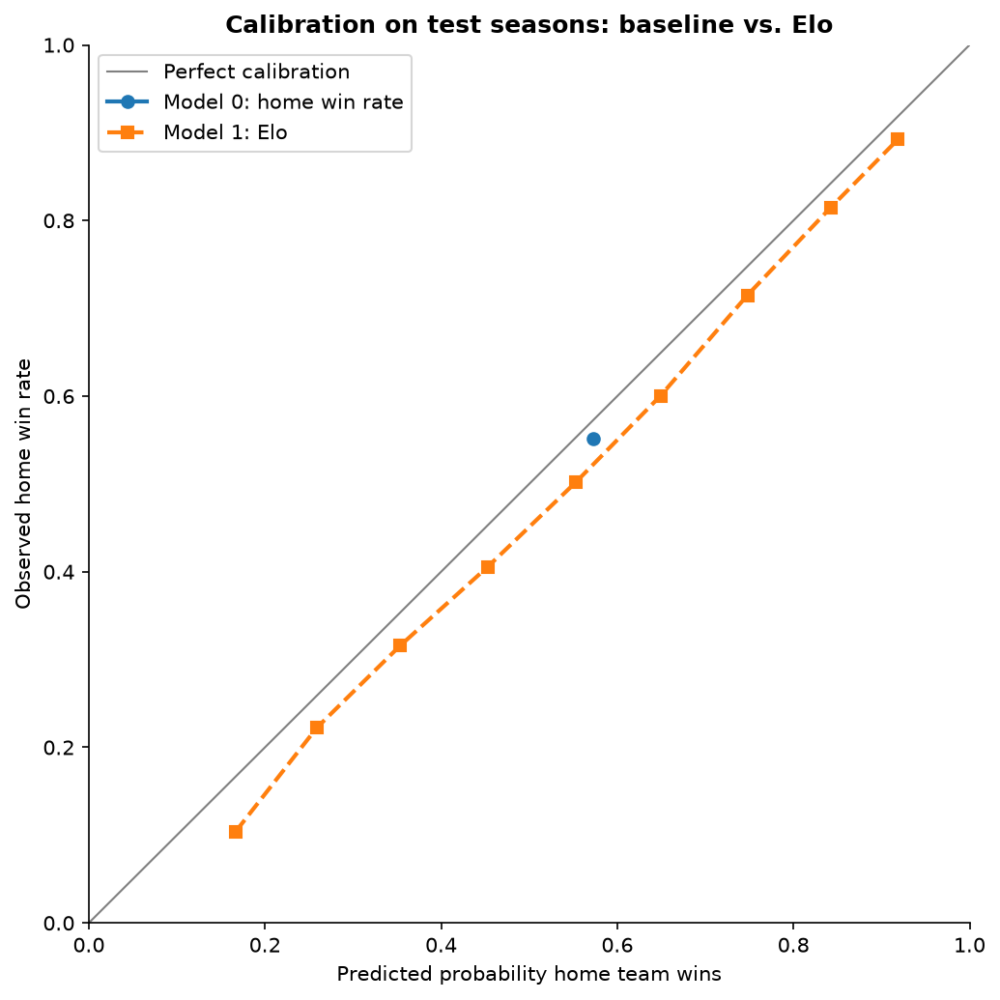

# Step 1 results: Model 0 vs. Model 1 (Elo)

Elo settings chosen on tune seasons 2015-16 to 2018-19: K = 15, home advantage = 75 Elo points.

## Overall
| view | model | n_games | accuracy | log_loss | brier |
|---|---|---|---|---|---|
| All test seasons | Model 0: home win rate | 8289 | 0.5517 | 0.6889 | 0.2478 |
| All test seasons | Model 1: Elo | 8289 | 0.6457 | 0.6283 | 0.2192 |
| Excluding 2019-20 & 2020-21 | Model 0: home win rate | 6150 | 0.5532 | 0.6881 | 0.2475 |
| Excluding 2019-20 & 2020-21 | Model 1: Elo | 6150 | 0.6512 | 0.6240 | 0.2172 |

## Is Elo's improvement real? (paired bootstrap, log loss)
Negative mean_diff = Elo better. If the 95% interval excludes 0, the gap is unlikely to be luck.

| view | comparison | mean_diff | ci_low | ci_high | share_A_better |
|---|---|---|---|---|---|
| All test seasons | Elo minus baseline | -0.0606 | -0.0678 | -0.0532 | 1.0000 |
| Excluding 2019-20 & 2020-21 | Elo minus baseline | -0.0641 | -0.0722 | -0.0550 | 1.0000 |

## By season
| season | n_games | actual_home_win_rate | baseline_acc | baseline_logloss | elo_acc | elo_logloss |
|---|---|---|---|---|---|---|
| 2019-20 | 1059 | 0.5515 | 0.5515 | 0.6900 | 0.6544 | 0.6295 |
| 2020-21 | 1080 | 0.5435 | 0.5435 | 0.6919 | 0.6056 | 0.6511 |
| 2021-22 | 1230 | 0.5439 | 0.5439 | 0.6912 | 0.6455 | 0.6387 |
| 2022-23 | 1230 | 0.5805 | 0.5805 | 0.6803 | 0.6350 | 0.6460 |
| 2023-24 | 1230 | 0.5431 | 0.5431 | 0.6911 | 0.6439 | 0.6174 |
| 2024-25 | 1230 | 0.5439 | 0.5439 | 0.6905 | 0.6569 | 0.6156 |
| 2025-26 | 1230 | 0.5545 | 0.5545 | 0.6875 | 0.6748 | 0.6025 |

