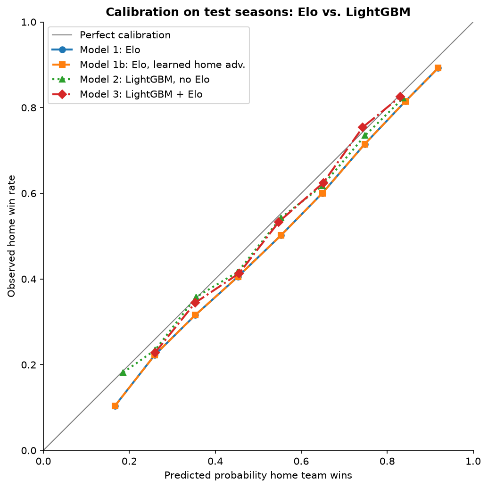
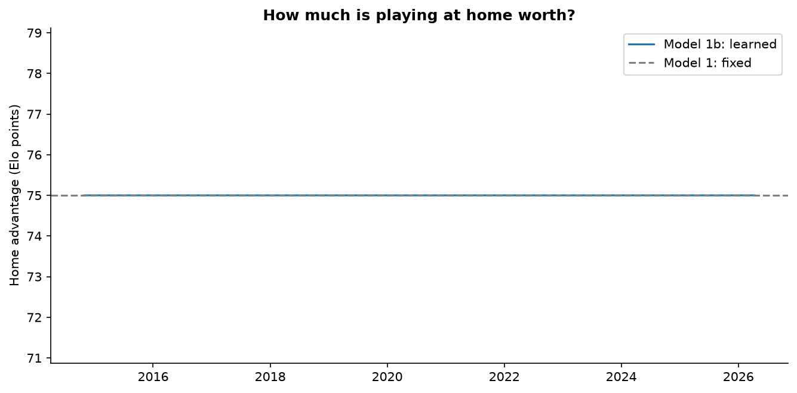

# Step 2 results: Elo vs. LightGBM

## Settings (chosen on tune seasons only)
- Model 1: K = 15, home advantage = 75 Elo points (fixed)
- Model 1b: K = 15, starting home advantage = 75, home-advantage learning rate = 0
- Model 2 (LightGBM, no Elo): {'num_leaves': 16, 'min_child_samples': 200, 'n_estimators': 200}
- Model 3 (LightGBM + Elo): {'num_leaves': 4, 'min_child_samples': 50, 'n_estimators': 200}

## Overall
| view | model | n_games | accuracy | log_loss | brier |
|---|---|---|---|---|---|
| All test seasons | Model 0: home win rate | 8289 | 0.5517 | 0.6889 | 0.2478 |
| All test seasons | Model 1: Elo | 8289 | 0.6457 | 0.6283 | 0.2192 |
| All test seasons | Model 1b: Elo, learned home adv. | 8289 | 0.6457 | 0.6283 | 0.2192 |
| All test seasons | Model 2: LightGBM, no Elo | 8289 | 0.6448 | 0.6321 | 0.2209 |
| All test seasons | Model 3: LightGBM + Elo | 8289 | 0.6515 | 0.6258 | 0.2181 |
| Excluding 2019-20 & 2020-21 | Model 0: home win rate | 6150 | 0.5532 | 0.6881 | 0.2475 |
| Excluding 2019-20 & 2020-21 | Model 1: Elo | 6150 | 0.6512 | 0.6240 | 0.2172 |
| Excluding 2019-20 & 2020-21 | Model 1b: Elo, learned home adv. | 6150 | 0.6512 | 0.6240 | 0.2172 |
| Excluding 2019-20 & 2020-21 | Model 2: LightGBM, no Elo | 6150 | 0.6486 | 0.6262 | 0.2181 |
| Excluding 2019-20 & 2020-21 | Model 3: LightGBM + Elo | 6150 | 0.6558 | 0.6206 | 0.2156 |

## Are the gaps real? (paired bootstrap, log loss)
Negative mean_diff = the first model is better. A gap counts only if the 95% interval excludes 0.

| view | comparison | mean_diff | ci_low | ci_high | share_A_better |
|---|---|---|---|---|---|
| All test seasons | H2 (as registered): Model 3 minus Model 1 | -0.0025 | -0.0047 | -0.0004 | 0.9880 |
| All test seasons | Fair check: Model 3 minus Model 1b | -0.0025 | -0.0047 | -0.0004 | 0.9880 |
| All test seasons | H3: Model 2 minus Model 3 | 0.0064 | 0.0041 | 0.0087 | 0.0000 |
| All test seasons | Model 1b minus Model 1 | 0.0000 | 0.0000 | 0.0000 | 0.0000 |
| Excluding 2019-20 & 2020-21 | H2 (as registered): Model 3 minus Model 1 | -0.0034 | -0.0061 | -0.0009 | 0.9955 |
| Excluding 2019-20 & 2020-21 | Fair check: Model 3 minus Model 1b | -0.0034 | -0.0061 | -0.0009 | 0.9955 |
| Excluding 2019-20 & 2020-21 | H3: Model 2 minus Model 3 | 0.0056 | 0.0031 | 0.0081 | 0.0000 |
| Excluding 2019-20 & 2020-21 | Model 1b minus Model 1 | 0.0000 | 0.0000 | 0.0000 | 0.0000 |

## Log loss by season
| season | n_games | home_win_rate | Model 0 | Model 1 | Model 1b | Model 2 | Model 3 |
|---|---|---|---|---|---|---|---|
| 2019-20 | 1059 | 0.5515 | 0.6900 | 0.6295 | 0.6295 | 0.6350 | 0.6315 |
| 2020-21 | 1080 | 0.5435 | 0.6919 | 0.6511 | 0.6511 | 0.6633 | 0.6497 |
| 2021-22 | 1230 | 0.5439 | 0.6912 | 0.6387 | 0.6387 | 0.6470 | 0.6366 |
| 2022-23 | 1230 | 0.5805 | 0.6803 | 0.6460 | 0.6460 | 0.6452 | 0.6426 |
| 2023-24 | 1230 | 0.5431 | 0.6911 | 0.6174 | 0.6174 | 0.6210 | 0.6159 |
| 2024-25 | 1230 | 0.5439 | 0.6905 | 0.6156 | 0.6156 | 0.6146 | 0.6093 |
| 2025-26 | 1230 | 0.5545 | 0.6875 | 0.6025 | 0.6025 | 0.6031 | 0.5988 |

## Share of LightGBM gain by feature group
| group | p_lgb_no_elo | p_lgb_elo |
|---|---|---|
| elo | 0.0000 | 0.6823 |
| team_strength | 0.7292 | 0.2384 |
| four_factors | 0.2249 | 0.0520 |
| situation | 0.0273 | 0.0251 |
| travel | 0.0187 | 0.0023 |

