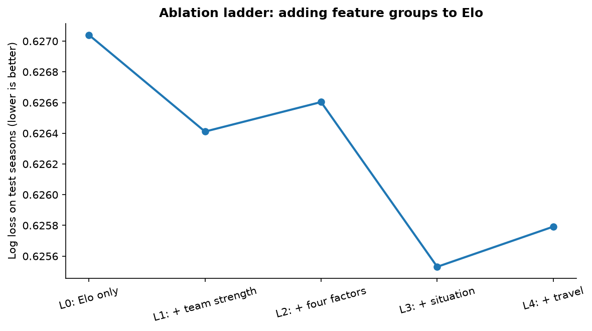
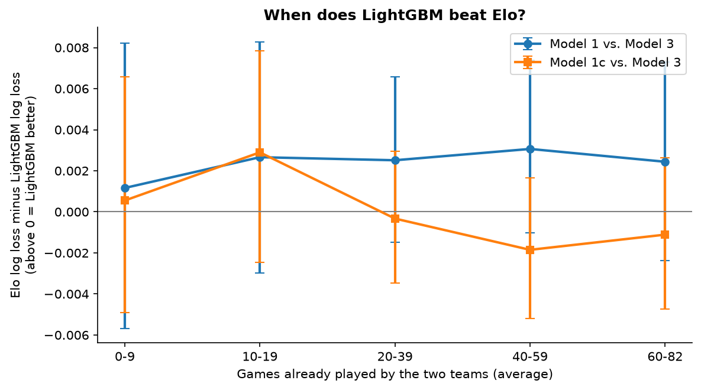
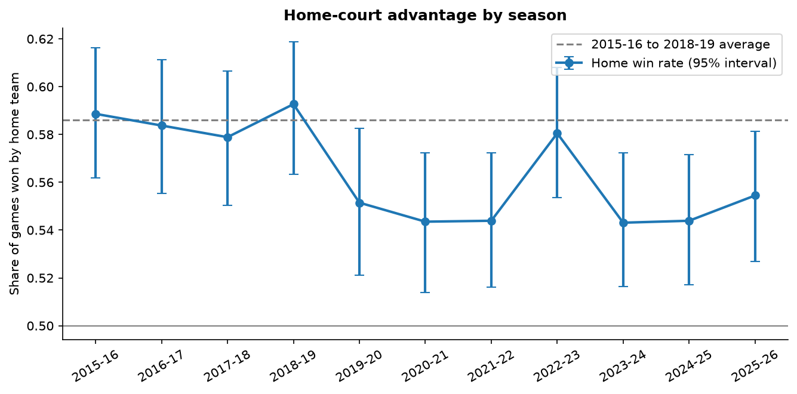

# Step 3 results: where the gains come from

Measurement rules were fixed before this analysis ran (see HYPOTHESES.md).

## H4: ablation ladder
step_diff = this rung's log loss minus the previous rung's (negative = improvement), with 95% interval.

| rung | n_features | n_games | accuracy | log_loss | brier | step_diff | step_ci_low | step_ci_high |
|---|---|---|---|---|---|---|---|---|
| L0: Elo only | 3 | 8289 | 0.6489 | 0.6270 | 0.2187 | nan | nan | nan |
| L1: + team strength | 22 | 8289 | 0.6516 | 0.6264 | 0.2183 | -0.0006 | -0.0020 | 0.0008 |
| L2: + four factors | 40 | 8289 | 0.6500 | 0.6266 | 0.2184 | 0.0002 | -0.0005 | 0.0009 |
| L3: + situation | 47 | 8289 | 0.6503 | 0.6255 | 0.2179 | -0.0011 | -0.0019 | -0.0002 |
| L4: + travel | 52 | 8289 | 0.6515 | 0.6258 | 0.2181 | 0.0003 | -0.0001 | 0.0007 |

Total improvement L0 to L4: 0.0012. Share from team strength (L0 to L1): 50%.

### Leave one group out (from Model 3)
Positive mean_diff = removing the group makes Model 3 worse.

| removed_group | mean_diff | ci_low | ci_high | share_A_better |
|---|---|---|---|---|
| team_strength | 0.0002 | -0.0009 | 0.0012 | 0.3835 |
| four_factors | -0.0007 | -0.0013 | -0.0000 | 0.9775 |
| situation | 0.0007 | -0.0000 | 0.0015 | 0.0355 |
| travel | -0.0003 | -0.0007 | 0.0001 | 0.9005 |

## H5: early-season games (both teams fewer than 20 games played)
gap = Elo log loss minus Model 3 log loss (positive = LightGBM better). diff = early gap minus later gap.

| comparison | n_early | n_later | early_gap | later_gap | diff_mean_diff | diff_ci_low | diff_ci_high |
|---|---|---|---|---|---|---|---|
| H5: Model 1 minus Model 3 | 2037 | 6252 | 0.0019 | 0.0027 | -0.0007 | -0.0058 | 0.0050 |
| Exploratory: Model 1c minus Model 3 | 2037 | 6252 | 0.0017 | -0.0010 | 0.0027 | -0.0016 | 0.0072 |

### Gap by games already played
| comparison | games_played | n_games | mean | ci_low | ci_high |
|---|---|---|---|---|---|
| H5: Model 1 minus Model 3 | 0-9 | 1072 | 0.0012 | -0.0057 | 0.0082 |
| H5: Model 1 minus Model 3 | 10-19 | 1059 | 0.0027 | -0.0030 | 0.0083 |
| H5: Model 1 minus Model 3 | 20-39 | 2099 | 0.0025 | -0.0015 | 0.0066 |
| H5: Model 1 minus Model 3 | 40-59 | 2099 | 0.0031 | -0.0010 | 0.0074 |
| H5: Model 1 minus Model 3 | 60-82 | 1960 | 0.0024 | -0.0024 | 0.0073 |
| Exploratory: Model 1c minus Model 3 | 0-9 | 1072 | 0.0006 | -0.0049 | 0.0066 |
| Exploratory: Model 1c minus Model 3 | 10-19 | 1059 | 0.0029 | -0.0025 | 0.0078 |
| Exploratory: Model 1c minus Model 3 | 20-39 | 2099 | -0.0003 | -0.0035 | 0.0030 |
| Exploratory: Model 1c minus Model 3 | 40-59 | 2099 | -0.0019 | -0.0052 | 0.0016 |
| Exploratory: Model 1c minus Model 3 | 60-82 | 1960 | -0.0011 | -0.0047 | 0.0026 |

## H6: home-court advantage
Home win rate 2020-21 minus 2015-16 to 2018-19 average (0.586): -0.0425 (95% interval -0.0735 to -0.0101).

| season | n_games | mean | ci_low | ci_high |
|---|---|---|---|---|
| 2015-16 | 1230 | 0.5886 | 0.5618 | 0.6163 |
| 2016-17 | 1230 | 0.5837 | 0.5553 | 0.6114 |
| 2017-18 | 1230 | 0.5789 | 0.5504 | 0.6065 |
| 2018-19 | 1230 | 0.5927 | 0.5634 | 0.6187 |
| 2019-20 | 1059 | 0.5515 | 0.5212 | 0.5826 |
| 2020-21 | 1080 | 0.5435 | 0.5139 | 0.5722 |
| 2021-22 | 1230 | 0.5439 | 0.5162 | 0.5724 |
| 2022-23 | 1230 | 0.5805 | 0.5537 | 0.6081 |
| 2023-24 | 1230 | 0.5431 | 0.5163 | 0.5724 |
| 2024-25 | 1230 | 0.5439 | 0.5171 | 0.5715 |
| 2025-26 | 1230 | 0.5545 | 0.5268 | 0.5813 |
| 2019-20 bubble games only | 88 | 0.5568 | 0.4545 | 0.6591 |

### Over-prediction: mean predicted home-win probability minus actual home-win rate
Positive = the model expects the home team to win more often than it did.

| season | model | mean | ci_low | ci_high |
|---|---|---|---|---|
| 2019-20 | Model 1 | 0.0370 | 0.0082 | 0.0649 |
| 2019-20 | Model 1c | 0.0370 | 0.0082 | 0.0649 |
| 2019-20 | Model 3 | 0.0268 | -0.0020 | 0.0551 |
| 2020-21 | Model 1 | 0.0525 | 0.0243 | 0.0809 |
| 2020-21 | Model 1c | 0.0525 | 0.0243 | 0.0809 |
| 2020-21 | Model 3 | 0.0411 | 0.0124 | 0.0696 |
| 2021-22 | Model 1 | 0.0533 | 0.0268 | 0.0786 |
| 2021-22 | Model 1c | 0.0220 | -0.0045 | 0.0474 |
| 2021-22 | Model 3 | 0.0347 | 0.0083 | 0.0596 |
| 2022-23 | Model 1 | 0.0160 | -0.0105 | 0.0428 |
| 2022-23 | Model 1c | -0.0163 | -0.0429 | 0.0104 |
| 2022-23 | Model 3 | -0.0162 | -0.0426 | 0.0109 |
| 2023-24 | Model 1 | 0.0487 | 0.0214 | 0.0728 |
| 2023-24 | Model 1c | 0.0178 | -0.0096 | 0.0420 |
| 2023-24 | Model 3 | 0.0230 | -0.0044 | 0.0471 |
| 2024-25 | Model 1 | 0.0493 | 0.0242 | 0.0740 |
| 2024-25 | Model 1c | 0.0187 | -0.0065 | 0.0434 |
| 2024-25 | Model 3 | 0.0146 | -0.0112 | 0.0391 |
| 2025-26 | Model 1 | 0.0389 | 0.0142 | 0.0651 |
| 2025-26 | Model 1c | 0.0085 | -0.0161 | 0.0347 |
| 2025-26 | Model 3 | 0.0044 | -0.0205 | 0.0306 |

